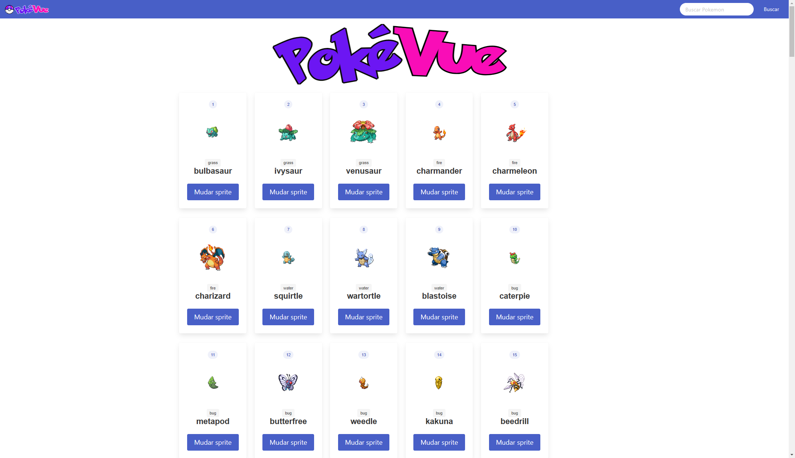
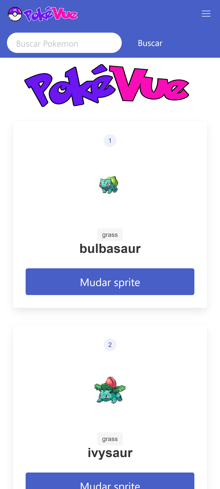

#

Projeto de pokedex criado com vue consumindo uma api-rest para receber os dados do servidor. Feito com todos os pokemons da primeira geração.

__Modo de usar__:
```
Digite o nome do pokemon que deseja, click em buscar.
```

[Acesse aqui!](https://leydilson-silva.github.io/PokeVue/)


## Preview




 


## Documentação da API

#### Retorna todos os itens

```script
axios.get("https://pokeapi.co/api/v2/pokemon?limit=151&offset=0")
```

| Parâmetro   | Tipo       | Descrição                           |
| :---------- | :--------- | :---------------------------------- |
| `pokemon?limit=151&offset=0` | `object` | retorna objeto com dados sobre os pokemons.|


## Documentação de cores

 | Cores de fundo | Cor do texto | cor de borda
| ----------------| -------------|-------------|
|  #ffffff  |  #ffffff |  #485fc7 |
|  #fafafa |  #485fc7 | - |
|  #f5f5f5 |  #3850b7 | - |
|  #eff1fa |  #4a4a4a | - |
|  #485fc7 |  #2c3e50 | - |
| - |  #363636 | - |
| - |   #000000 | - |
| - |   #000000b3 |- |

## Stack utilizada

**Front-end:** 
- Vue.js
- BulmaCSS

**Back-end:** 
- PokéAPI


## 🔗 Contatos
[](https://github.com/Leydilson-Silva) 

[](https://www.linkedin.com/in/leydilson/)


## Referência

 - [Developer Mozilla](https://developer.mozilla.org/en-US/docs/Web/JavaScript/Reference/Global_Objects/Intl/NumberFormat/NumberFormat)
 - [Bulma Documentation](https://bulma.io/documentation/)
  - [VueJs Documentation](https://br.vuejs.org/v2/guide/)
 - [Stackoverflow](https://stackoverflow.com/questions/22057610/uncaught-typeerror-cannot-read-property-value-of-null)
 - [Awesome Readme Templates](https://awesomeopensource.com/project/elangosundar/awesome-README-templates)


## Licença

[](https://choosealicense.com/licenses/mit/)

